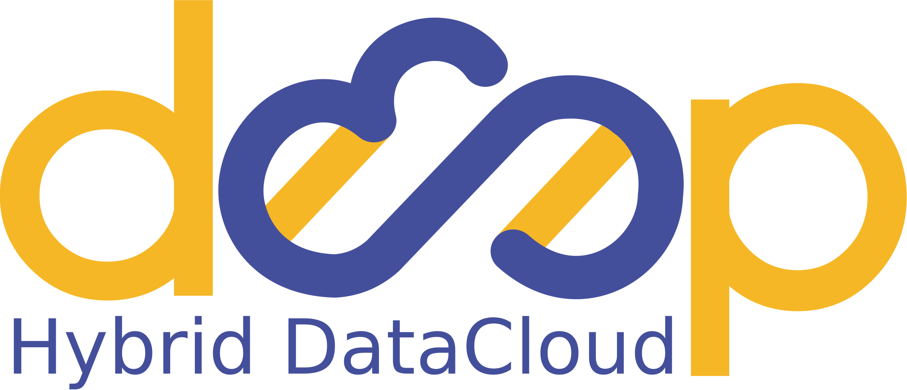
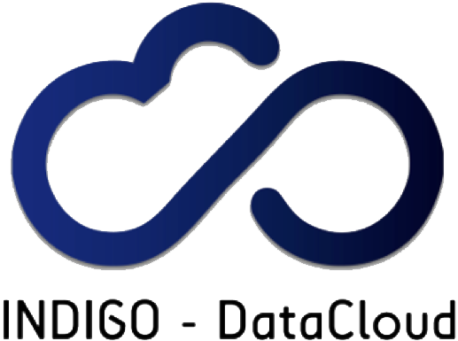
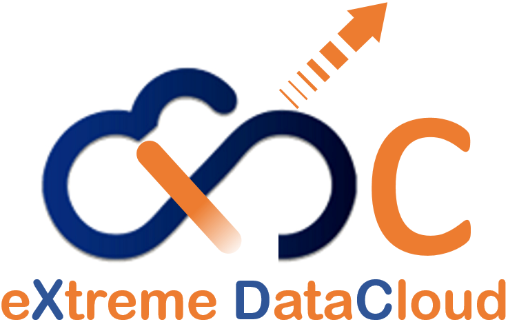

---
author-meta:
- Pablo Orviz
- Alvaro Lopez
- Doina Cristina Duma
- Giacinto Donvito
- Mario David
- Jorge Gomes
date-meta: '2019-02-06'
keywords:
- research software
- software quality assurance
- software lifecycle
- devops
- software automation
- software quality baseline
- software testing
- software deployment
- agile development
lang: en-US
title: A set of Common Software Quality Assurance Baseline Criteria for Research Projects
...

 
{height="50px"}&nbsp;&nbsp;&nbsp;&nbsp;
{height="50px"}&nbsp;&nbsp;&nbsp;&nbsp;
{height="50px"}

_A DOI-citable version of this manuscript is available at <http://hdl.handle.net/10261/160086>_.

<small><em>
This manuscript
([permalink](https://indigo-dc.github.io/sqa-baseline/v/ccc71e7375ef32d83f9082621aedfaa4c558aad9/))
was automatically generated
from [indigo-dc/sqa-baseline@ccc71e7](https://github.com/indigo-dc/sqa-baseline/tree/ccc71e7375ef32d83f9082621aedfaa4c558aad9)
on February 6, 2019.
</em></small>

## Authors

+ **Pablo Orviz** 
    {.inline_icon}
    [0000-0002-2473-6405](https://orcid.org/0000-0002-2473-6405)
    · {.inline_icon}
    [orviz](https://github.com/orviz) 
  <small>
     Spanish National Research Council (CSIC); Institute of Physics of Cantabria (IFCA)
  </small>

+ **Alvaro Lopez** 
    {.inline_icon}
    [0000-0002-0013-4602](https://orcid.org/0000-0002-0013-4602)
    · {.inline_icon}
    [alvaro.lopez](https://github.com/alvaro.lopez) 
  <small>
     Spanish National Research Council (CSIC); Institute of Physics of Cantabria (IFCA)
  </small>

+ **Doina Cristina Duma** 
    {.inline_icon}
    [0000-0002-0124-4870](https://orcid.org/0000-0002-0124-4870)
    · {.inline_icon}
    [caifti](https://github.com/caifti) 
  <small>
     National Institute of Nuclear Physics (INFN)
  </small>

+ **Giacinto Donvito** 
    {.inline_icon}
    [0000-0002-0628-1080](https://orcid.org/0000-0002-0628-1080) 
  <small>
     National Institute of Nuclear Physics (INFN)
  </small>

+ **Mario David** 
    {.inline_icon}
    [0000-0003-1802-5356](https://orcid.org/0000-0003-1802-5356)
    · {.inline_icon}
    [mariojmdavid](https://github.com/mariojmdavid) 
  <small>
     Laboratory of Instrumentation and Experimental Particle Physics (LIP)
  </small>

+ **Jorge Gomes** 
    {.inline_icon}
    [0000-0002-9142-2596](https://orcid.org/0000-0002-9142-2596)
    · {.inline_icon}
    [jorge-lip](https://github.com/jorge-lip) 
  <small>
     Laboratory of Instrumentation and Experimental Particle Physics (LIP)
  </small>

## Abstract {.page_break_before}
The purpose of this document is to define a set of quality standards,
procedures and best practices to conform a Software Quality Assurance plan to
serve as a reference within the European research ecosystem related projects
for the adequate development and timely delivery of software products.

## Document Log
| Issue | Date | Comment |
|----------|----------|----------|
| v1.0 | 31/01/2018 | First draft version |
| v2.0 | 05/02/2018 | Updated criteria |

## Introduction and Purpose
This document has been tailored upon the recommendations and requirements found
in the Initial Plan for Software Management and Pilot Services deliverable
@5VMJDbB2,
produced by the INDIGO-DataCloud project. These guidelines evolved throughout
the project’s lifetime and have been eventually extended in the
DEEP-Hybrid-DataCloud and eXtreme DataCloud subsequent projects. The result is
a consolidated Software Quality Assurance (SQA) baseline criteria emanated
from the European Open Science Cloud (EOSC), which aims to outline the SQA
principles to be considered in the upcoming software development efforts within
the European research community, and continuously evolve in order to be aligned
with future software engineering practices and security recommendations.

## Goals
1. Set the base of minimum SQA criteria that a software developed within EOSC
development project SHOULD fulfill.
2. Enhance the visibility, accessibility and distribution of the produced
source code through the alignment to the Open Source Definition.
3. Promote code style standards to deliver good quality source code emphasizing
its readability and reusability.
4. Improve the quality and reliability of software by covering different
testing methods at development and pre-production stages.
5. Propose a change-based driven scenario where all new updates in the source
code are continuously validated by the automated execution of the relevant
tests.
6. Adopt an agile approach to effectively produce timely and audience-specific
documentation.
7. Lower the barriers of software adoption by delivering quality documentation
and the utilization of automated deployment solutions.
8. Encourage secure coding practices and security static analysis at the
development phase while providing recommendations on external security
assessment.

## Notational Conventions
The keywords “MUST”, “MUST NOT”, “REQUIRED”, “SHALL”, “SHALL NOT”, “SHOULD”,
“SHOULD NOT”, “RECOMMENDED”, “MAY”, and “OPTIONAL” in this document are to be
interpreted as described in RFC 2119 @Ms8G1A12.

## Quality Criteria
The following sections describe the quality conventions and best practices that
apply to the development phase of a software component within the EOSC
ecosystem. These guidelines ruled the software development process of the
former European Commission-funded project INDIGO-DataCloud, where they have
proved valuable for improving the reliability of software produced in the
scientific European arena.

The next sections describe the development process driven by a change-based
strategy, followed by a continuous integration approach. Changes in the source
code, trigger automated builds to analyze the new contributions in order to
validate them before being added to the software component code base.
Consequently, software components are more eligible for being deployed in
production infrastructures, reducing the likelihood of service disruption.

### Code Accessibility
1. Following the open-source model, the source code being produced MUST be open
   and publicly available to promote the adoption and augment the visibility of
   the software developments.
2. Source code MUST use a Version Control System (VCS).
   i. It is RECOMMENDED that all software components delivered by the same
	  project agree on a common VCS.
3. Source code produced within the scope of a broader development project
   SHOULD reside in a common organization of a version control repository
   hosting service.

### Licensing
1. As open-source software, source code MUST adhere to an open-source license
to be freely used, modified and distributed by others.
   i. Non-licensed software is exclusive copyright by default.
2. License MUST be compliant with the Open Source Definition @HdIbF8WL.
   i. RECOMMENDED licenses are listed in the Open Source Initiative portal
      under the Popular Licenses category @xVJMmGVr.
3. Licenses MUST be physically present (e.g. as a LICENSE file) in the root of
   all the source code repositories related to the software component.

### Code Workflow
A change-based approach is accomplished with a branching model.

1. The main branch in the source code repository MUST maintain a working state
   version of the software component.
    i. Main branch SHOULD be protected to disallow force pushing, thus
       preventing untested and unreviewed source code from entering the
       production-ready version.
   ii. New features SHOULD only be merged in the main branch whenever the SQA
       criteria is fulfilled.
2. New changes in the source code MUST be placed in individual branches.
   i. It is RECOMMENDED to agree on a branch nomenclature, usually by
      prefixing, to differentiate change types (e.g. feature, release, fix).
3. The existence of a secondary long-term branch that contains the changes for
   the next release is RECOMMENDED.
    i. Next release changes come from the individual branches.
   ii. Once ready for release, changes in the secondary long-term branch are
       merged into the main branch and versioned. At that point in time, main
       and secondary branches are aligned. This step SHOULD mark a production
       release.
4. Semantic Versioning @13UfgtMhu specification is RECOMMENDED for
   tagging the production releases.

### Code Style
Code style requirements pursue the correct maintenance of the source code by
the common agreement of a series of style conventions. These vary based on the
programming language being used.

1. Each individual software product MUST comply with a de-facto code style
   standard for althe programming languages used in the codebase.
   i. Compliance with multiple standards MAY exist.
2. Custom code style guidelines MUST be avoided, only considered in the
   hypothetical evenof programming languages without existing community style
   standards.
    i. Custom styles MUST be documented by defining each convention and its
       expected output.
   ii. Custom styles SHOULD evolve over time towards a more consistent
       definition.
3. Exceptions of individual conventions from the main definition are allowed
   but SHOULD bavoided
   1. Absence of standard conventions SHOULD be justified and tracked.
4. Code style compliance testing MUST be automated and MUST be triggered for
   each candidate change in the source code.

### Unit Testing
Unit testing evaluates all the possible flows in the internal design of the
code, so that its behaviour becomes apparent. It is a key type of testing for
early detection of failures in the development cycle.

1. Minimum acceptable code coverage threshold SHOULD be 70%.
   i. Unit testing coverage SHOULD be higher for those sections of the code
      identified as critical by the developers, such as units part of a
      security module.
   ii. Unit testing coverage MAY be lower for external libraries or pieces of
       code not maintained within the product’s code base.
2. Units SHOULD reside in the repository code base but separated from the main
   code.
3. Unit testing coverage MUST be checked on change basis.
4. Unit testing coverage MUST be automated.
   i. When working on automated testing, the use of testing doubles is
      RECOMMENDED to mimic a simplistic behaviour of objects and procedures.

### Functional Testing
Functional testing involves the verification of the software component’s
identified functionality, based on requested requirements and agreed design
specifications. This type of software testing focus on the evaluation of the
functionality that the software component exposes, leaving apart any internal
design analysis or side-effects to external systems.

1. Functional testing SHOULD tend to cover the full set of functionality that
   the software component claims to provide.
2. Functional tests SHOULD be checked automatically with the exception of those
   functionality that require human interaction, such as Graphical User
   Interfaces (GUI).
3. When working on automated testing, the use of testing doubles is RECOMMENDED
   to mimic a simplistic behaviour of objects and procedures.
4. Functional tests SHOULD reside in the software component repository code
   base but separated from the main code.
5. Regression testing, that checks the conformance with previous tests, is
   covered at this stage by executing the complete set of functional tests
   available.
6. Functional and regression testing MUST be checked on change basis.
7. Functional and regression testing coverage MAY NOT be suitable for automated
   testing.

### Integration Testing
Integration testing refers to the evaluation of the interactions among coupled
software components or parts of a system that cooperate to achieve a given
functionality.

1. Integration testing outcome MUST guarantee the overall operation of the
   software component whenever new functionality are involved.
2. Integration testing MAY be complemented with Acceptance and Scalability
   testing.
3. Integration testing MAY NOT be suitable for automated testing.
4. On lack of automation, pilot service infrastructures or local testbeds MAY
   be used.
5. Integration testing MAY NOT be viable to be checked on change basis, as it
   is likely to involve complex scenarios.

### Documentation
1. Documentation MUST be treated as code.
   i. Version controlled, it MAY reside in the same repository where the source
      code lies.
2. Documentation MUST use plain text format using a markup language, such as
   Markdown or reStructuredText.
   i. It is RECOMMENDED that all software components delivered by the same
      project agree on a common markup language.
3. Documentation MUST be online available in a documentation repository.
   i. Documentation SHOULD be rendered automatically.
4. Documentation MUST be updated on new software versions involving any
   substantial or minimal change in the behaviour of the application.
5. Documentation MUST be updated whenever reported as inaccurate or unclear.
6. Documentation MUST be produced according to the target audience, varying
   according to the software component specification. The identified types of
   documentation and their RECOMMENDED content are:
     i. README file
        * One-paragraph description of the application.
        * A “Getting Started” step-by-step description on how to get a
          development environment running (prerequisites, installation).
        * Automated test execution how-to.
        * Links to the external documentation below (production deployment,
          user guides).
        * Contributing code of conduct (optionally linked to an external
          CONTRIBUTING file)
        * Versioning specification.
        * Author list and contacts.
        * License information, with a link to the detailed description in an
          external LICENSE file.
        * Acknowledgments.
    ii. Developer
        * Private API documentation.
        * Structure and interfaces.
        * Build documentation.
   iii. Deployment and Administration
        * Installation and configuration guides.
        * Service Reference Card, with the following RECOMMENDED content:
        * Brief functional description.
        * List of processes or daemons.
        * Init scripts and options.
        * List of configuration files, location and example or template.
        * Log files location and other useful audit information.
        * List of ports.
        * Service state information.
        * List of cron jobs.
        * Security information.
        * FAQs and troubleshooting.
    iv. User
        * Public API documentation.
        * Command-line (CLI) reference.
7. Documentation MUST be checked on change basis.

### Security
1. Secure coding practices SHALL be applied into all the stages of a software
   component development lifecycle.
   i. Compliance with Open Web Application Security Project (OWASP) secure
      coding guidelines @13kp1l5RC
      is RECOMMENDED, even for non-web applications.
2. Source code SHALL use automated linter tools to perform static application
   security testing (SAST) @18kdpX8Tx
   that flag common suspicious constructs that may cause a bug or lead to a
   security risk (e.g. inconsistent data structure sizes or unused resources).
3. Dynamic application security testing (DAST) @WzDw9I2K
   SHALL be performed from the outside, to software components in an operating
   state, to look for security vulnerabilities (e.g. SQL injection, cross-site
   scripting).
4. Manual penetration testing MAY be part of the application security
   verification effort.
5. Security code reviews [9] for certain vulnerabilities SHOULD be done as part
   of the identification of potential security flaws in the code. Inputs SHOULD
   come from automated linters and manual penetration testing results.
6. World-writable files or directories MUST NOT be present in the product’s
   configuration or logging locations.
7. World-writable files SHOULD NOT be created while the service is in
   operation. Whenever they are required, the relevant files MUST be
   documented.
8. World-readable files MUST NOT contain passwords.
9. The services delivered SHALL adhere to any extra security policies or
   requirements set at the operational level.

### Code Review
Code review implies the informal, non-automated, peer, human-based revision of
any change in the source code. It appears as the last step in the change
management pipeline, once the candidate change has successfully passed over the
required set of change-based tests.

1. Code reviews MUST be done in the agreed peer review tool within the project,
   with the following RECOMMENDED functionality:
     i. Allows general and specific comments on the line or lines that need to
        be reviewed.
    ii. Shows the results of the required change-based test executions.
   iii. Allows to prevent merges of the candidate change whenever not all the
        required tests are successful.
   Exceptions to this rule cover the third-party or upstream contributions
   which MAY use the existing mechanisms or tools for code review provided by
   the target software project. This exception MUST only be allowed whenever
   the external revision lifecycle does not interfere with the project
   deadlines.
2. Code reviews MUST be open and collaborative, allowing external expert
   revisions.
3. Code reviews SHOULD be lightweight and informal, meaning that some of the
   areas the reviewers MAY focus are:
     i. Message description: commit message is clear, self-explanatory and
        describes precisely the objectives being addressed.
    ii. Goal or scope: change is needed and/or addresses/fixes the whole set of
        objectives.
   iii. Code analysis: useless statements in the code, library or modules
        imported but never used or code style suggestions.
    iv. Review of required tests: current battery of tests is sufficient for
        validation.
     v. Review of documentation: whether the change SHOULD bring along a
        corresponding update in the documentation.
4. Code reviews MUST be checked on change basis.
5. Code reviews SHOULD assess the inherent security risk of the changes,
   ensuring that the security model has not been downgraded or compromised by
   the changes.

### Automated Deployment
Production-ready code SHALL be deployed as a workable system with the minimal
user or system administrator interaction leveraging software configuration
management (SCM) tools.

1. A SCM module is treated as code.
   i. Version controlled, it SHOULD reside in a different repository than the
      source code to facilitate the distribution.
2. It is RECOMMENDED that all software components delivered by the same project
   agree on a common SCM tool.
   i. However, software products are not restricted to provide a unique
      solution for the automated deployment.
3. Any change affecting the application’s deployment or operation MUST be
   subsequently reflected in the relevant SCM modules.
4. Official repositories provided by the manufacturer SHOULD be used to host
   the SCM modules, thus augmenting the visibility and promote external
   collaboration.

## References {.page_break_before}

<!-- Explicitly insert bibliography here -->

